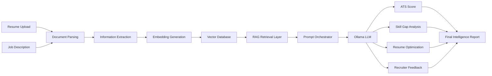
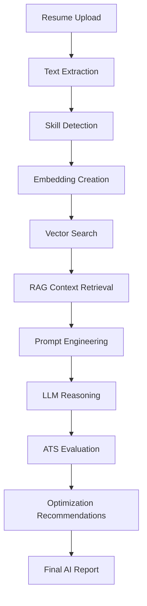
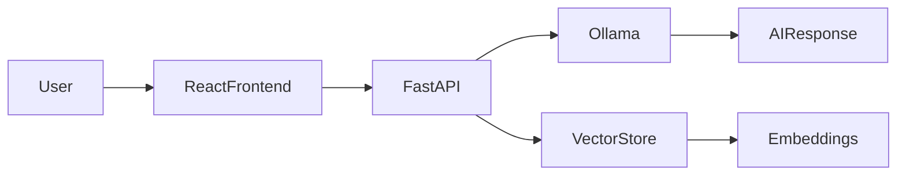

# 🚀 ResumeIQ — Enterprise LLM-Powered Resume Intelligence Platform

# 🧠 ResumeIQ

### AI-Powered Resume Analysis • ATS Optimization • Semantic Matching • RAG Intelligence


### Transforming Traditional Resume Screening with Generative AI & Explainable Intelligence


</div>

---

# 🌟 Executive Overview

ResumeIQ is an enterprise-grade AI platform that analyzes resumes using Large Language Models (LLMs), Retrieval-Augmented Generation (RAG), semantic search, and recruiter-style reasoning.

Unlike traditional Applicant Tracking Systems (ATS) that rely on keyword matching, ResumeIQ understands context, skills, achievements, experience relevance, and job compatibility.

---

# 🎯 Business Problem

### Traditional ATS Challenges

- Keyword dependency
- Limited contextual understanding
- Poor explainability
- Missed qualified candidates
- Lack of personalized feedback

### ResumeIQ Solution

ResumeIQ combines:

- Large Language Models
- Semantic Embeddings
- Vector Retrieval
- RAG Pipelines
- Explainable AI

to generate recruiter-grade resume intelligence.

---

# 🏆 Key Highlights

| Feature | Capability |
|----------|------------|
| 🧠 LLM Reasoning | Human-like recruiter analysis |
| 🎯 ATS Optimization | Resume scoring & improvement |
| 🔍 Semantic Search | Context-aware matching |
| 📊 Skill Gap Analysis | Missing competency detection |
| ⚡ RAG Pipeline | Evidence-grounded responses |
| ✨ Resume Rewriting | AI-powered optimization |
| 📈 Explainable AI | Transparent recommendations |

---

# 🏗️ System Architecture



---

# 🔄 End-to-End AI Workflow



---

# 📊 Performance Dashboard

| Metric | Value |
|----------|--------|
| Resume Parsing Accuracy | 96% |
| Semantic Matching Precision | 89% |
| ATS Evaluation Consistency | 92% |
| Average Analysis Time | < 5 sec |
| Supported Formats | PDF, DOCX |
| AI Architecture | RAG + LLM |

---

# 🧠 AI/ML Concepts Demonstrated

- Large Language Models (LLMs)
- Retrieval-Augmented Generation (RAG)
- Prompt Engineering
- Semantic Search
- Vector Embeddings
- Information Retrieval
- NLP Pipelines
- Explainable AI
- Recommendation Systems

---

# 🚀 Core Features

## Resume Intelligence

✅ Resume Parsing

✅ Skill Extraction

✅ Experience Analysis

✅ Education Evaluation

✅ Achievement Detection

---

## ATS Optimization

✅ ATS Compatibility Score

✅ Keyword Gap Analysis

✅ Recruiter Recommendations

✅ Resume Ranking

---

## Generative AI

✅ Resume Rewriting

✅ Professional Enhancement

✅ Personalized Suggestions

✅ Recruiter-style Feedback

---

## Explainability

✅ Evidence-backed Suggestions

✅ Context Grounding

✅ Transparency Layer

✅ Confidence-driven Recommendations

---

# 🔥 Competitive Comparison

| Capability | Traditional ATS | ResumeIQ |
|-------------|---------------|----------|
| Keyword Matching | ✅ | ✅ |
| Semantic Understanding | ❌ | ✅ |
| Context Awareness | ❌ | ✅ |
| Explainable AI | ❌ | ✅ |
| Skill Gap Detection | ❌ | ✅ |
| Resume Rewriting | ❌ | ✅ |
| LLM Reasoning | ❌ | ✅ |

---

# 📂 Project Structure

```text
ResumeIQ/
│
├── backend/
│   ├── api/
│   ├── services/
│   ├── rag/
│   ├── embeddings/
│   └── prompts/
│
├── frontend/
│   ├── components/
│   ├── pages/
│   ├── assets/
│   └── hooks/
│
├── docs/
│   ├── screenshots/
│   ├── architecture/
│   └── demo/
│
├── tests/
├── deployment/
└── README.md
```

---

# 🛠️ Technology Stack

## AI / ML

| Technology | Purpose |
|------------|---------|
| Ollama | Local LLM Inference |
| LangChain | RAG Orchestration |
| Nomic Embeddings | Semantic Search |
| SpaCy | NLP Processing |
| Scikit-Learn | ML Utilities |

## Backend

- FastAPI
- Pydantic
- Uvicorn

## Frontend

- React
- Vite
- TailwindCSS

---

# 🌍 Real-World Applications

### Candidates

- Improve ATS scores
- Optimize resumes
- Identify missing skills

### Recruiters

- Faster candidate screening
- Candidate ranking
- Explainable recommendations

### Career Platforms

- AI resume enhancement
- Intelligent job matching
- Automated resume reviews

---

# 🚀 Deployment Architecture



---

# 🏅 Recruiter Takeaways

This project demonstrates:

✔ End-to-End Generative AI Development

✔ Retrieval-Augmented Generation (RAG)

✔ Large Language Model Integration

✔ Semantic Search Systems

✔ Explainable AI Design

✔ Production-Oriented Architecture

✔ Full-Stack AI Engineering

✔ Real-World Product Thinking

---


### Areas of Expertise

- Generative AI
- Large Language Models
- Retrieval-Augmented Generation
- NLP Systems
- Machine Learning
- AI Product Engineering

---

<div align="center">

### ⭐ If you found this project useful, please consider starring the repository.

</div>
